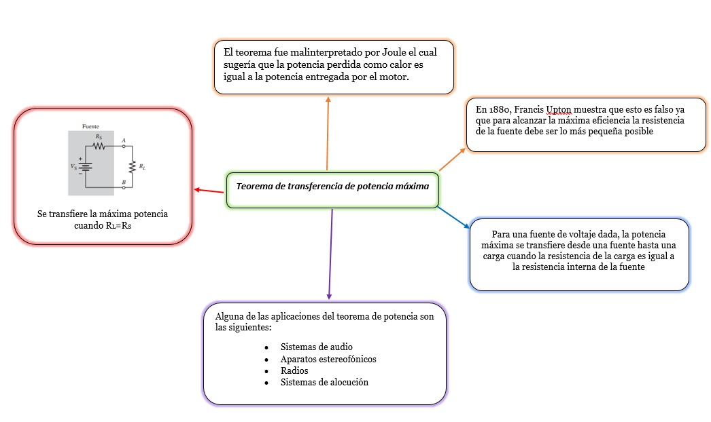
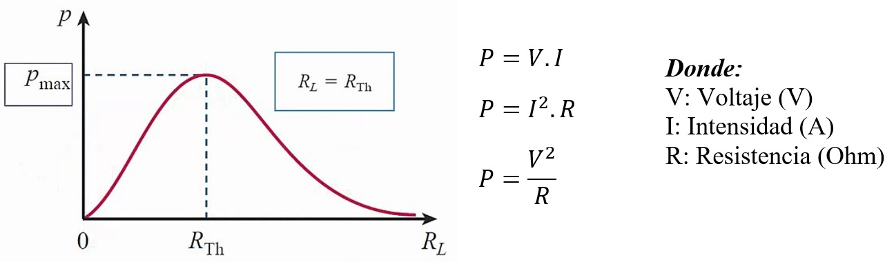

# Informe 4

1.OBJETIVOS 

•	

• 

• .

•	

•	

2.MARCO TEÓRICO

El teorema de transferencia de máxima potencia nos dice que para una fuente de voltaje dada, la potencia máxima se transfiere desde una fuente hasta una carga cuando la resistencia de la carga es igual a la resistencia interna de la fuente. Se adjunta mas información en el siguiente cuadro.  

Se hace uso de la ley de Ohm y la fórmula de la potencia para determinar la potencia suministrada a la carga (PL).

3. DIAGRAMAS

Simulación en Tinkercad (circuito)

Simulación en Tinkercad (conectado multímetros)

4. LISTA DE COMPONENTES

5. EXPLICACIÓN 

-Tabla Resultados obtenidos  

Cálculo de errores

Preguntas

¿Se cumple el Teorema de la Máxima Transferencia de Potencia? Argumente su respuesta.

En este e circuito no se cumple el teorema ya  que ninguna de nuestras resistencias RL tenia el valor  igual a la resistencia  interna de la fuente.

¿Cuál fue la potencia máxima en RL?

La potencia máxima fue 0.04648 W

¿Para qué valor de RL se obtiene la MTP?

Para la resistencia de 1kOhm

6. CONCLUSIONES:

• 

•	

•
•

7. BIBLIOGRAFÍA

•

•Alulema Darwin (2020). Capítulo 2. Ley de las Corrientes de Kirchhoff. Págs (56-77) 

•

•

•

•Santos M. (2021). Tinkercad. Recuperado de: https://www.tinkercad.com/things/5c7HMBvtmsq-voltaje

8. ANEXOS

![](img

