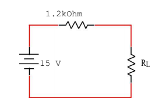

# Informe 4

1.OBJETIVOS 

• Analizar el circuito eléctrico presentado en el laboratorio junto a las resistencias y los demás materiales a usar, con fin de obtener el máximo valor de la potencia  eléctrica. Guiarnos de un simulador y modelar un equivalente de thevenin en la practica, haciendo uso de cada resistencia de carga y calcular su valor respectivo.  

•	Determinar experimentalmente la condición necesaria o aproximada de la resistencia de carga para hallar la Máxima Transferencia de Potencia del circuito eléctrico.

• Estudiar el comportamiento de un circuito DC mediante la aplicación del principio de la Máxima Transferencia de Potencia.

• Comprobar experimentalmente el Teorema de la Máxima Transferencia de Potencia denotando el error porcentual teórico y práctico.

• Hacer uso de la teoria del tema a tratar.

2.MARCO TEÓRICO

El teorema de transferencia de máxima potencia nos dice que para una fuente de voltaje dada, la potencia máxima se transfiere desde una fuente hasta una carga cuando la resistencia de la carga es igual a la resistencia interna de la fuente. Se adjunta mas información en el siguiente cuadro.  

Se hace uso de la ley de Ohm y la fórmula de la potencia para determinar la potencia suministrada a la carga (PL).

3. DIAGRAMAS

*Diagrama general (circuito):*

*Simulación en Tinkercad (circuito):*

*Simulación en Tinkercad (conectando los multímetros):*

4. LISTA DE COMPONENTES

5. EXPLICACIÓN 

*Tabla Resultados obtenidos*  

*Cálculo de errores*

*Preguntas:*

*¿Se cumple el Teorema de la Máxima Transferencia de Potencia? Argumente su respuesta.*

En este e circuito no se cumple el teorema ya  que ninguna de nuestras resistencias RL tenia el valor  igual a la resistencia  interna de la fuente.

*¿Cuál fue la potencia máxima en RL?*

La potencia máxima fue 0.04648 W

*¿Para qué valor de RL se obtiene la MTP?*

Para la resistencia de 1kOhm

6. CONCLUSIONES:

• El teorema de la máxima transferencia de potencia se deriva del teorema de Thevenin y el de Norton con algunos pasos extras de cáculo elemental. Llegamos a la demostración teórica, evidentemente la máxima potencia se originará cuando la  resistencia de carga tenga un valor semejante a la resistencia de Thevenin o Norton.

• La potencia en la resistencia variable, depende de los valores del circuito equivalente de Thevenin.

• También se estudio el término de eficiencia o rendimiento de una resistencia de carga.

• Cuando la resistencia de la carga es menor o mayor que la resistencia equivalente, la potencia se reduce, según ilustra la curva de la potencia eléctrica en funcion de su resistencia de carga.

7. BIBLIOGRAFÍA

•Floyd, T. L., Salas, R. N., González, L. M. O., & López, G. P. (2007). Principios de circuitos eléctricos. Pearson Educación.

•Alulema Darwin (2020). Capítulo 3. Transferencia de Potencia Máxima. Págs (64-67) 

•Salazar Gómez Antonio José.(2016). Universidad de los Andes. "THÉVENIN, NORTON Y MÁXIMA TRANSFERENCIA DE POTENCIA". Págs.(99-122)

8. ANEXOS

